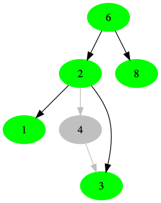
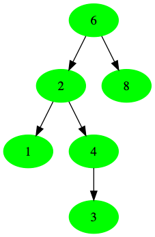

# Binary Search Tree

二叉树的一个典型应用是查找中的使用，它是一种特殊的二叉树，对于每个节点`X`:

1. 它的左子树的值都小于`X`节点的值
2. 它的右子树的值都大于`X`节点的值


上面是两个二叉树，但是只有左边的是二叉搜索树，右边对于节点`6`来说，它的左子树并不都小于(节点`7`)该节点的值。


## 创建

突然发现之前的创建都非常繁琐，看了[数据结构与算法分析 C语言版本](#refrence_1),发现它的实现巧妙而且节省空间，果然是大神。

### 节点

它的节点与普通二叉树相同,指针域包含两个指针,分别指向左孩子和有孩子🐸。

```c
// define the binary search tree node
struct binary_search_tree_node
{
    struct binary_search_tree_node *left; // left child
    struct binary_search_tree_node *right; // right child
    Element val; // the value is stored here
};

typedef struct binary_search_tree_node TreeNode;
// real node define
typedef TreeNode *Position;
// tree define
typedef TreeNode *SearchTree;

```

节点的创建，无非为内存的申请，其实下面这个方法存在缺陷，当内存不足时，会抛出错误。

```c

TreeNode *tree_node_new(Element e, SearchTree left, SearchTree right)
{
    // assume having sufficient space always
    TreeNode *node = (TreeNode *)malloc(sizeof(TreeNode));
    node->left = left;
    node->right = right;
    return node;
}

```


### 根节点

之前实现链表的时候，但链表为空的时候，会创建一个哑节点，这里不再推荐这种方式，虽然它少了一些逻辑的判断。这里推荐在使用时创建。
这里创建和回收使用了同一套方法，So Brilliant !

```c
SearchTree
make_empty(SearchTree t)
{
    if (t)
    {
        make_empty(t->left);
        make_empty(t->right);
        free(t);
    }
    return NULL;
}

```

## find element

查询，二叉查找树的主要应用就是查询。查询分三种，普通查询`find`,查询最小值`fin_min`,查询最大值`fin_max`:

### find
因为二叉树的特点:节点的左子树均小于该节点，右子树均大于该节点,因此查找每个元素也是非常简单的。即:如果当前节点值小于目的值，则在其左子树内查询，否则右子树内查询，如果相等，则返回该节点即可。

```c
// recursive search node
Position find(Element e, SearchTree t, compare_func cmp)
{
    if (t)
    {
        int cp = cmp(t->val, e);
        if (cp == 0)
            return t;
        else if (cp > 0)
            return find(e, t->left, cmp);
        else
            return find(e, t->right, cmp);
    }
    return NULL;
}
```

### find min

二叉搜索树的最小节点在其最左边的叶子节点的值。

```c
// the mininum value in tree the left leaf
Position find_min(SearchTree t)
{
    if (t == NULL)
    {
        return NULL;
    }
    else if (t->left == NULL)
    {
        return t;
    }
    else
    {
        return find_min(t->left);
    }
}

```

### find max

二叉搜索树的最大节点，位于其最右边的叶子节点

```c
Position find_max(SearchTree t)
{
    if (t == NULL)
    {
        return NULL;
    }
    else if (t->right == NULL)
    {
        return t;
    }
    else
    {
        return find_max(t->right);
    }
}

```


## Insert element

节点的插入，用迭代的思想很容易理解，首先与当前节点(若当前节点存在)比较，假如刚好等于当前节点，直接忽略(其实有些时候，会给它一个权重值，更新权重值).
假如值大于当前节点，插入当前节点的右子树上，同理插入到当前节点的左子树上。如果当前节点不存在，新建节点并将返回，更新父节点的指向。

```c
// recursive insert
SearchTree insert(Element e, SearchTree t, compare_func cmp)
{
    if (t == NULL)
    {
        t = tree_node_new(e, NULL, NULL);
        return t;
    }
    int cp = cmp(e, t->val);
    if (cp == 0)
        return t;
    else if (cp < 0)
        t->left = insert(e, t->left, cmp);
    else
        t->right = insert(e, t->right, cmp);
    return t;
}

```


## Delete element

节点删除，现查找到对应的节点。对于该节点`A`，它的子节点或为一个，比较好处理，只需将其更换为子节点即可。但是若是，存在两个节点，




两个节点的删除，这个情况比较复杂，不过由于它的右子树的最小节点没有左节点，故将该节点使用右子树的最小节点来代替即可。



删除`节点2` 示意图


```c
SearchTree remove(Element e, SearchTree t, compare_func cmp)
{
    SearchTree node = find(e, t, cmp);
    if (node)
    {
        if (node->left != NULL && node->right != NULL)
        {
            SearchTree mini = find_min(node->right);
            node->val = mini->val;
            node->right = remove(mini->val, node->right, cmp);
        }
        else
        {
            if (node->left != NULL)
            {
                node = node->left;
            }
            else if (node->right != NULL)
            {
                node = node->right;
            }
            free(node);
        }
    }
    return node;
}


```


## Time complexity 

时间复杂度分析:

一棵树的所有节点的深度和，定义为内部路径长。

定义D(N)为节点树为N的树的内部路径长，它由一个i节点的左子树和(N-i-1)的右子树以及一个根节点组成。
则由:
1. D(1) = D(0) =  0 
2. D(N) = D(i)+D(N-i-1)+N-1 0<=i<N
   
求解可以得到:

D(N) = 


## Implement

[binary_search_tree](../src/binary_search_tree.c)


## Reference

1.<span id="refrence_1">数据结构与算法分析 C语言版本. Simple Chinese. Page-73</span>
