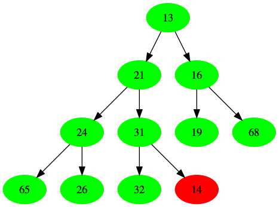
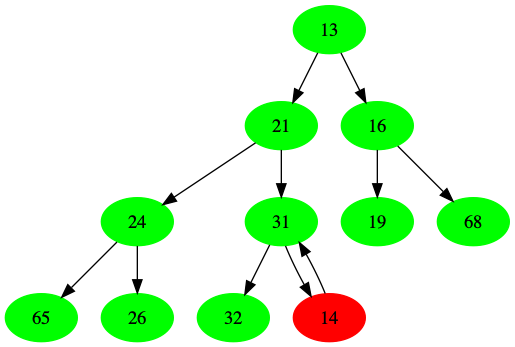
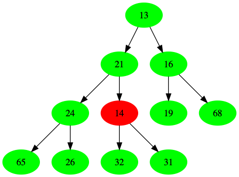
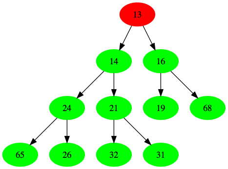
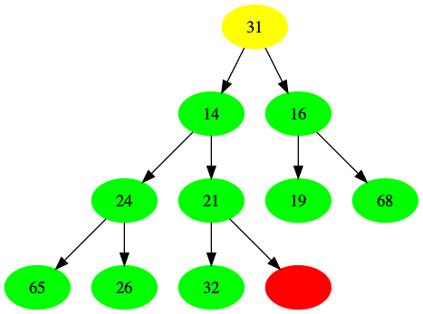
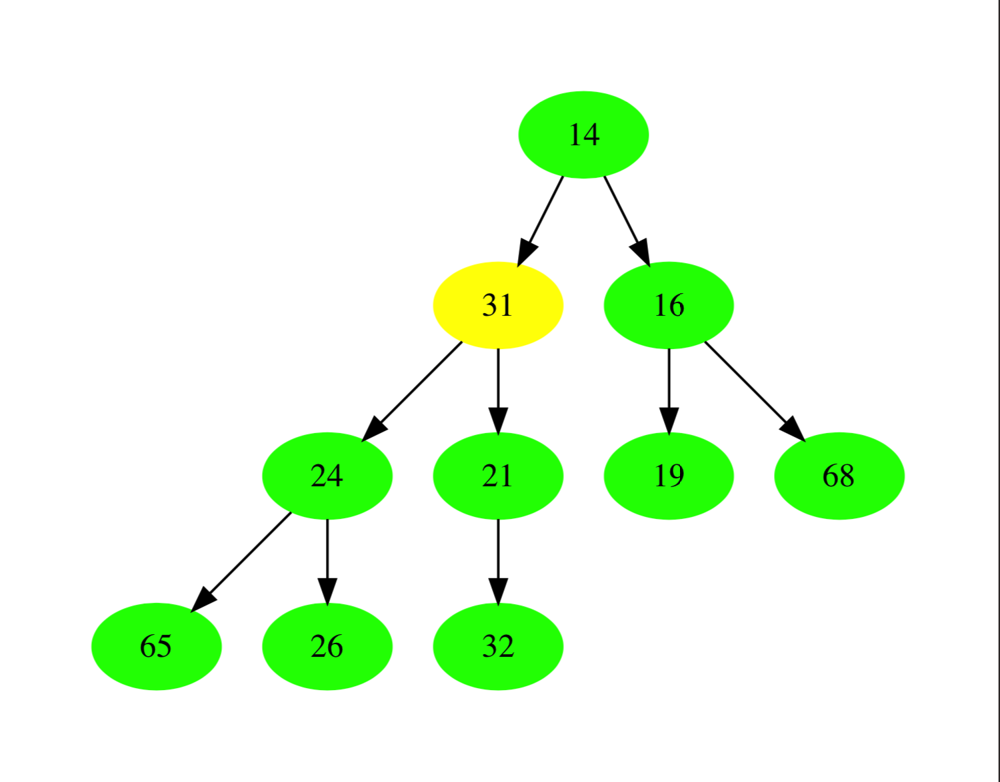
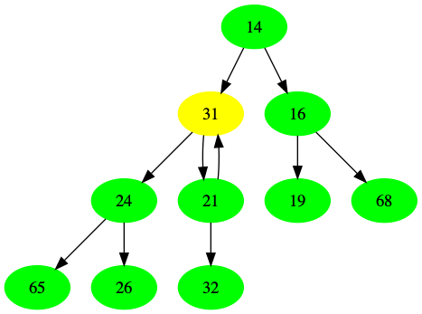
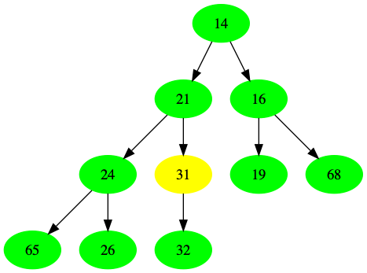

# 优先队列 (堆)

它的引出，由于操作系统的调度,如何某个任务拥有较高的优先级，因此不能够将其直接放到队列的尾部,这就引出了堆的概念。

## 二叉堆

比较常见的一个堆，就是二叉堆,它的特点是任意一个节点的值，都小于它的后裔(最小堆)，同时它又是一个完全二叉树。

如下图(红色是空节点)


### 抽象

由于二叉堆是一个完全二叉树，所以采用数组实现是一个比较好的选择，能够充分利用到索引的性质
例如一个节点的索引位置是`n` (索引下标从0开始)
则有:
```
// 父节点 索引
parent-index= (n-1)/2

// 两个子节点为
left-index = 2(n+1)-1 = 2n+1
right-index = 2(n+1) = 2n+2

```


### 插入与上滤

以插入节点 14 为例看一下整个插入过程

1. 在下一个空位置(n)插入 14
  

2. 14 与它的父节点(n/2)的值比较，若小于它，则进行交换
  
  

3. 重复上面过程，若比父节点值小，继续进行交换，直到满足条件或者到达跟节点
   
   

上面这个逐步向上转移的过程，叫做**上滤**

#### 抽象

```c

void insert(Heap heap, Element e, compare_func cmp)
{
    if (heap->size >= heap->cap)
    {
        return;
    }
    heap->elements[heap->size] = e;
    //  调整
    int p = heap->size;
    while (p > 0)
    {
        Element parent = heap->elements[(p-1)/ 2];
        if (cmp(e, parent) < 0)
        {
            swap(e, parent);
            p = (p-1)/2;
        }
        else
        {
            break;
        }
    }
    heap->size++;
    return;
}

```

### 删除与下滤



删除最小节点(13)
1. 删除最小节点(13)，使用最后一个元素(31)代替
   
   
   
2. 开始进行调整，当前节点(31)与它的左右节点(14,16)比较，选取最小的值(14)进行替换
   
     
     
     
3. 同理，继续向下进行比较，当前节点(31)，与它的左右节点(21,24)比较，选择最小的值(21)进行替换
   
     
     
   
逐步向下比较的过程，叫做下滤

#### 抽象

```c
void delete_min(Heap heap, compare_func cmp)
{
    if (heap->size == 0)
    {
        return;
    }
    heap->elements[0] = heap->elements[heap->size - 1];

    int p = 0;
    heap->size--;
    while (p < heap->size)
    {
        int right = 2 * p + 2;
        int left = right - 1;
        if (right < heap->size)
        {
            int temp = cmp(heap->elements[right], heap->elements[left]) < 0 ? right : left;
            p = cmp(heap->elements[p], heap->elements[temp]) < 0 ? p : temp;
        }
        else if (left < heap->size)
        {
            p = cmp(heap->elements[p], heap->elements[left]) < 0 ? p : left;
        }
        else
        {
            break;
        }
    }
    return;
}

```
