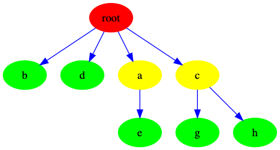
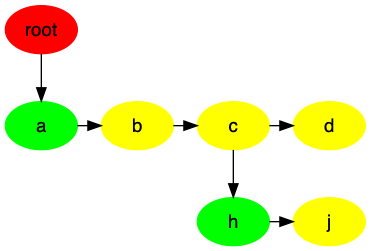

# Tree
对于大量的数据，链表的线性访问时间太长。而树是一种非线性的数据结构，它的大部分操作的平均运行时间是`O(logN)`
树也是很多集合类的基础,如`set`和`map`。

## 定义

树是`n`个节点的有限集。对于每棵树:
1. 都有一个根节点(`root`)
2. 当n>1时，其它节点都有`m`个**不相交的有限集**(这里在后面很有用)，也称为`子树`(`subtree`)
3. 如果一个子树没有子节点，则称之为 `叶子节点`(`leaf`)
4. 具有同一个`父节点`(`parent`)的节点，为`兄弟节点`(`sibling`)
5. 对于任意节点n,它的**深度**为其到跟节点的路径的`边数`

它的结构通常如下:



红色为根节点，绿色是叶子节点，蓝色是边，黄色是兄弟节点(未画全)。


## 树的实现

树的实现结构可以有很多种，比较合理的是采用链表的结构，而针对每个节点来说，其只需要知道第一个子节点和下一个兄弟节点即可。

### 单个节点的结构

```c
typedef struct tree_node
{
    Element e; // the value
    struct tree_node *nextSibling;
    struct tree_node *firstChild;

} TreeNode;

```

### 树的结构

对于树，只要根节点的位置，即可拿到其它全部节点的信息
```
typedef struct tree
{
    TreeNode *root;
} Tree;
```

### 整体的结构示意图

因此整体的结构示意图如下:



绿色节点代表第一个子节点(first child), 黄色代表下一个兄弟节点(sibling node)


